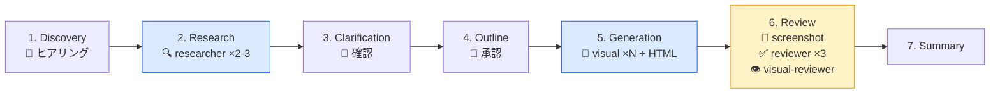

# slide-deck

LLMフレンドリーなHTMLスライドフレームワーク + Claude Code プラグイン。

## 概要

- **Web Components** (`<s-deck>`, `<s-slide>`) でスライド構造を定義
- **Tailwind CSS** でコンテンツを自由にスタイリング
- **PDF出力** — ブラウザの印刷機能で完結（16:9、余白なし）
- **Claude Code プラグイン** — `/slide` コマンドでAIがスライドを自動生成

## `/slide` ワークフロー



| Phase | 名前 | 実行者 | ツール / エージェント | やること |
|---|---|---|---|---|
| 1 | Discovery | LLM + ユーザー | AskUserQuestion | テーマ把握、種類・枚数・コピーライトをヒアリング |
| 2 | Research | サブエージェント (並列) | `slide-researcher` x2-3 | WebSearch でコンテンツ調査・データ収集 |
| 3 | Clarification | LLM + ユーザー | AskUserQuestion | 調査結果の確認、含める/除外する情報の判断 |
| 4 | Outline | LLM + ユーザー | AskUserQuestion | レイアウト付きアウトライン設計、ユーザー承認 |
| 5 | Generation | LLM + サブエージェント (並列) | `slide-visual` x N, Write | HTML生成 + SVG図解を並列生成 |
| 6 | Review | サブエージェント (並列) + Bash | `slide-screenshot`, `slide-reviewer` x3, `slide-visual-reviewer` | スクリーンショット撮影 → ファクトチェック・デザイン・技術・ビジュアル品質の4観点で並列レビュー |
| 7 | Summary | LLM | Write | 成果物記録、フィードバック保存、次のアクション提案 |

### コンポーネント一覧

| 種類 | 名前 | 説明 |
|---|---|---|
| コマンド | `/slide` | 7フェーズ オーケストレーター |
| スキル | `slide-generation` | フレームワーク API リファレンス + デザイン原則 |
| エージェント | `slide-researcher` | WebSearch でコンテンツ調査・データ収集 |
| エージェント | `slide-visual` | SVG 図解・ダイアグラム生成 |
| エージェント | `slide-reviewer` | ファクトチェック・デザイン・HTML構造レビュー |
| エージェント | `slide-visual-reviewer` | スクリーンショットを画像で読み取りビジュアル品質レビュー |
| CLI | `slide-screenshot` | Puppeteer でスライドを PNG 撮影（`bin/` で自動 PATH 追加） |

## クイックスタート

### プラグインでスライド生成（推奨）

```bash
# プラグインをインストール
claude plugin install slide-deck

# スライドを生成
claude
> /slide 新機能の紹介
```

### フレームワーク単体で手書き

```html
<!DOCTYPE html>
<html lang="ja">
<head>
  <meta charset="UTF-8">
  <meta name="viewport" content="width=device-width, initial-scale=1.0">
  <title>My Slides</title>
  <script src="https://cdn.tailwindcss.com/"></script>
  <script src="https://unpkg.com/slide-deck@latest/dist/slide-deck.js"></script>
</head>
<body>
  <s-deck>
    <s-slide layout="title" theme="dark" bg="linear-gradient(135deg, #0f172a, #1e293b)">
      <h1 class="text-5xl font-black text-white">Hello, slide-deck</h1>
      <p class="text-xl text-slate-400 mt-4">LLMフレンドリーなスライド</p>
    </s-slide>

    <s-slide layout="text">
      <h2 class="text-3xl font-bold mb-4">特徴</h2>
      <ul class="space-y-2 text-lg text-slate-600">
        <li>HTMLが一級市民</li>
        <li>Tailwindで自由にスタイリング</li>
        <li>PDFボタン一発でエクスポート</li>
      </ul>
    </s-slide>
  </s-deck>
</body>
</html>
```

## フレームワーク API

フレームワーク固有の知識はこれだけ。残りは Tailwind CSS。

### `<s-deck>`

スライドのコンテナ。ツールバー（ナビゲーション、プレゼンモード、PDF出力）を自動生成。

### `<s-slide>`

| 属性 | 説明 | 例 |
|---|---|---|
| `layout` | レイアウトプリセット | `title`, `text`, `text-image`, `image-text`, `two-column`, `grid-2x2`, `full-image`, `chart`, `section` |
| `theme` | テーマ。`dark` で文字色を自動反転 | `dark` |
| `bg` | 背景。CSS の `background` 値 | `#0f172a`, `linear-gradient(...)` |

### `data-area` 属性

グリッドレイアウト（`text-image`, `image-text`, `chart`）の子要素にロールを明示：

```html
<s-slide layout="text-image">
  <div data-area="text">...</div>
  <div data-area="visual"><!-- 自動で中央揃え --></div>
</s-slide>
```

## プロジェクト構成

```
slide-deck/
├── packages/core/          # npm パッケージ（Web Components + CSS）
├── plugin/                 # Claude Code プラグイン
│   ├── commands/slide.md   #   /slide コマンド（7フェーズ）
│   ├── agents/             #   サブエージェント（researcher, visual, reviewer, visual-reviewer）
│   ├── bin/                #   CLI ツール（slide-screenshot）
│   └── skills/             #   フレームワークリファレンス
├── examples/               # サンプル HTML
└── docs/                   # 設計ドキュメント
```

## 開発

```bash
npm install
npm run dev --workspace=packages/core   # watch モード
npm run build --workspace=packages/core # プロダクションビルド

# プラグインのローカルテスト
claude --plugin-dir plugin/
```

## ライセンス

MIT
